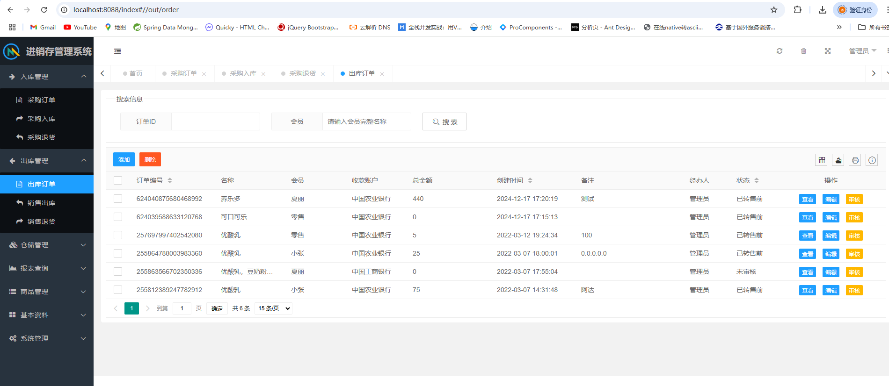
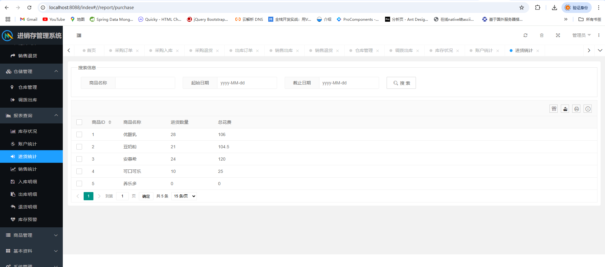
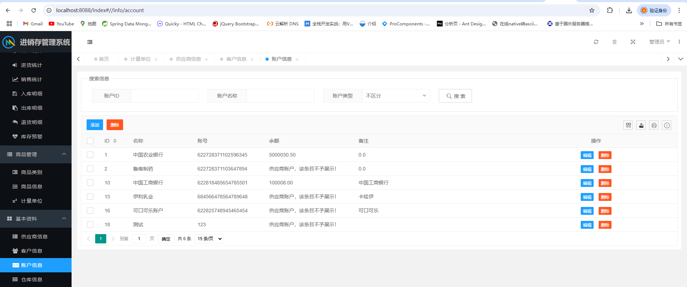

适合初学同学练手项目，部署简单，代码简洁清晰；

愿世界和平再无bug

# 一、系统架构

######      前端：html| layui

######      后端：springboot | mybatis| thymeleaf 

######      环境：jdk1.8+ | mysql8.0 | maven | redis

# 二、代码及数据库

# 三、相关功能介绍

#### 1.登录

#### 2.首页

#### 3.入款管理->采购订单

#### 4.入款管理->采购入库

#### 5.入款管理->采购退货

#### 6.出库管理->出库订单

#### 7.出库管理->销售出库

#### 8.出库管理->销售退货

#### 9.仓储管理->仓库管理

#### 10.仓储管理->调拨出库

#### 11.报表查询->库存状况

#### 12.报表查询->账户统计

#### 13.报表查询->进货统计

#### 14.报表查询->销售统计

#### 15.报表查询->入库明细

#### 16.报表查询->出库明细

#### 17.报表查询->退货明细

#### 18.报表查询->库存预警

#### 19.商品管理->商品类别

#### 20.商品管理->商品信息

#### 21.商品管理->计量单位

#### 22.基本资料->供应商信息

#### 23.基本资料->客户信息

#### 24.基本资料->账户信息

#### 25.基本资料->仓库信息

#### 26.系统管理->用户管理

#### 27.系统管理->日志管理

#### 28.系统管理->功能管理

#### 29.账户信息->基本资料

#### 30.账户信息->修改密码

